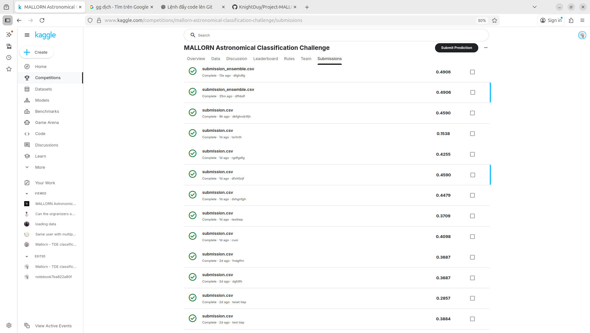
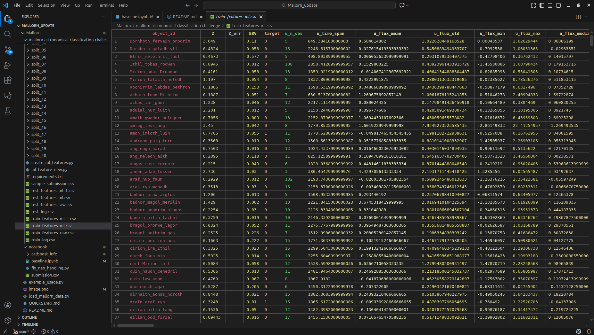
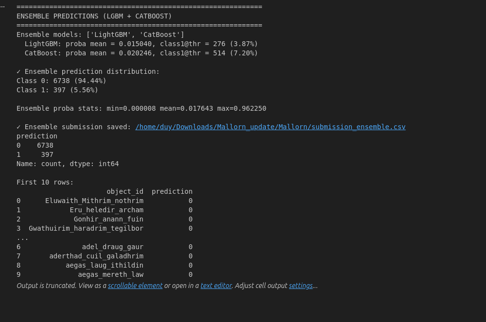

# Mallorn Astronomical Classification Challenge - Data Loader

Python code xử lý dữ liệu Mallorn astronomical classification challenge.

Video Thuyet trinh : https://drive.google.com/drive/folders/1lAA7bJfv8GkUWK_GBqrUeNkSFKSaMhSa?usp=drive_link

Bằng chứng nộp bài lên Kaggle, bao gồm ảnh chụp màn hình và liên kết đến bài dự thi Kaggle của nhóm: https://www.kaggle.com/competitions/mallorn-astronomical-classification-challenge/submissions#



Báo cáo: https://docs.google.com/document/d/1vr10rQCeDxsT7jm5tLbNBGEkFPHmPjwd/edit?usp=sharing&ouid=108579479565852243878&rtpof=true&sd=true

Slide :https://docs.google.com/presentation/d/1QvC-zQYGugSa6OE5R501Lzyll0DJZMMEeRkJKcK-XiM/edit?usp=sharing

Giới thiệu

Đây là dự án môn học thực hiện trên bộ dữ liệu của Mallorn Astronomical Classification Challenge (Kaggle).
Mục tiêu của dự án là xây dựng pipeline học máy hoàn chỉnh để phân loại các đối tượng thiên văn thành Transient và Non-transient dựa trên dữ liệu lightcurve không đều theo thời gian.

Dự án bao gồm:
  Xây dựng Data Loader
  Feature Engineering từ time-series
  Huấn luyện và đánh giá mô hình
  Nộp bài và đánh giá trên Kaggle


Mục tiêu bài toán
Bài toán: Binary Classification

Target variable:
    0: Non-transient objects
    1: Transient objects

Thách thức chính:

  Lightcurve là time-series không đều
  Mỗi object có số lượng quan sát và filter khác nhau
  Không thể đưa trực tiếp vào mô hình ML truyền thống

  ## Cấu trúc dữ liệu
Dataset bao gồm:

- **train_log.csv**: Metadata và labels cho training data (3,044 objects)
- **test_log.csv**: Metadata cho test data (7,136 objects)
- **sample_submission.csv**: Format file submission mẫu
- **split_01 đến split_20**: 20 folders chứa lightcurve data
  - `train_full_lightcurves.csv`: Time-series data cho training
  - `test_full_lightcurves.csv`: Time-series data cho testing

### Metadata Columns

**Training:**
- `object_id`: ID của object
- `Z`: Redshift
- `Z_err`: Redshift error
- `EBV`: Extinction (E(B-V))
- `SpecType`: Spectroscopic type (AGN, SN Ia, SN II, SN Ib, TDE)
- `English Translation`: Tên object đã được dịch
- `split`: Split number
- `target`: Label (0 hoặc 1) - **đây là target cần predict**

**Testing:**
- Giống như training nhưng không có column `target`

### Lightcurve Columns

- `object_id`: ID của object
- `Time (MJD)`: Thời gian quan sát (Modified Julian Date)
- `Flux`: Giá trị flux
- `Flux_err`: Flux measurement error
- `Filter`: Photometric filter (u, g, r, i, z, y)

## Cài đặt

```bash
pip install -r requirements.txt
```

## Sử dụng
Feature Engineering
Với mỗi filter (u, g, r, i, z, y), trích xuất:

(a) Thống kê cơ bản
  n_obs
  time_span
  flux_mean, flux_std
  flux_min, flux_max, flux_median
  amplitude
(b) Phân phối
  flux_skew
  flux_kurtosis
(c) Động học lightcurve
  t_peak
  rise_time
  decay_time
  max_slope_up
  max_slope_down
(d) Diện tích
  auc (trapezoidal integration)

4.2 Feature giữa các filter (Cross-filter)
(a) Color indices
Ví dụ:
  color_mean_u_g
  color_mean_g_r
  color_mean_r_i
  → Phản ánh màu sắc / phổ năng lượng
(b) Chênh lệch thời điểm peak
  t_peak_diff_u_g
  t_peak_diff_r_i
  → Phản ánh tiến hóa theo bước sóng
4.3 Metadata features
  Kết hợp thêm:
  Z
  Z_err
  EBV
4.4 Kết quả feature set
  Xuất ra:
  train_features_ml.csv

  test_features_ml.csv

Pipeline học máy
  - Load feature CSV
  - Xử lý missing values : xu ly NAN
  - Scale features (StandardScaler) : min max scaler
  - Chia tập dữ liệu
  Mô hình sử dụng : 
      Logistic Regression 
      LightGBM 
      catboost
      ....
  Lý do chọn:
      Phù hợp với dữ liệu tabular
      Huấn luyện nhanh
      Hoạt động tốt với feature engineered data
Ket qua cua mo hinh : 


## License

Data từ Mallorn Astronomical Classification Challenge.

